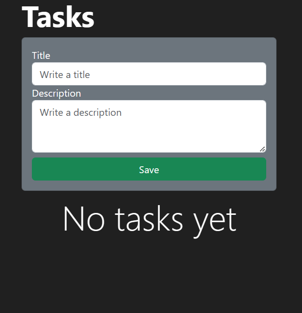
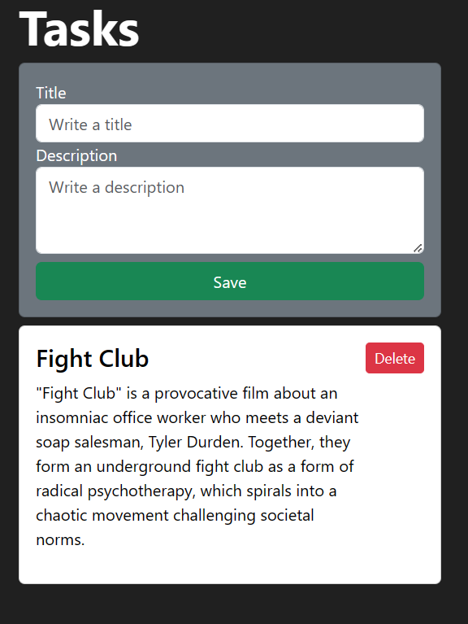

# Task Manager Django

This repository contains the Task Manager Django application, a simple and intuitive task management tool developed using Django and PostgreSQL. It's styled with Bootstrap for a more user-friendly interface.

## Description

Task Manager Django is a straightforward application that allows you to add and delete tasks. The user interfaceis served on a Docker container andis accessible through a web browser. It has a clean and modern interface thanks to the use of Bootstrap.

The application is connected to a PostgreSQL database to persist the data across sessions.




*The above screenshots is a preview of how the application looks*

## Getting Started

### Dependencies

- Docker and Docker Compose installed in your system.

### Setup and Installation

1. Clone this repository to your local machine.

```bash
$ git clone <repo_url>
```

2. Run the Django migrations. This command will create the necessary tables in your PostgreSQL database.

```bash
$ docker-compose run web python Task_manager_Django/manage.py migrate
```

### Start the application.
```
bash
$ docker-compose up
```

### Usage

Once the application is running, you can access the user interface by opening a web browser and navigating to the following URL:

```
bash
http://localhost:8000/tasks/
```

From there, you can add tasks, view existing tasks, and delete tasks as needed.

## Contribution
Pull requests are welcome. For major changes, please open an issue first to discuss what you would like to change.

## License
This project is licensed under MIT License.

## Contact
For any issues, please feel free to reach me out at <https://www.linkedin.com/in/gabvill/>.

